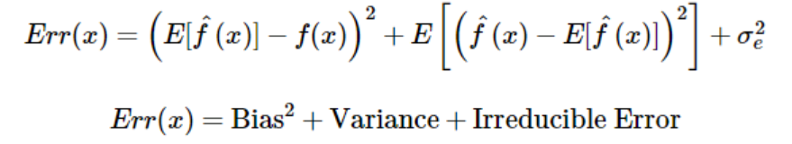
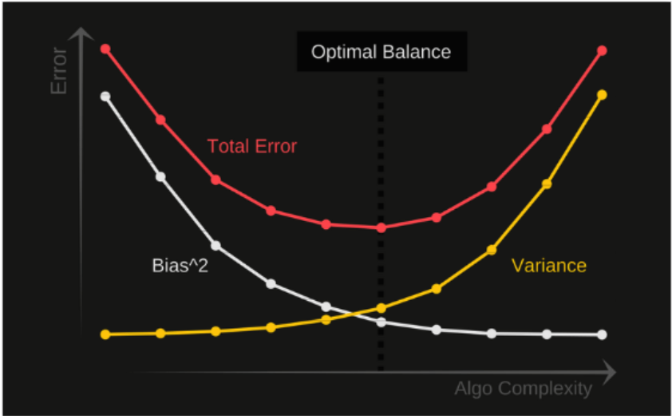

## How to split data

There are typically 3 types of splits we do on data:
* <ins>Training Set</ins> - Used for building models
    * Within training, we will sometimes also do cross-validation to tune hyperparameters
* <ins>Validation Set</ins> - Used for picking between models
* <ins>Test Set</ins> - Estimating performance of our model (most realistic estimate for real world performance)

## Bias-Variance Tradeoff
* <ins>What is Bias?</ins>
    * Bias is the difference between the average prediction of our model and the correct value which we are trying to predict. Model with high bias pays very little attention to the training data and oversimplifies the model. It always leads to high error on training and test data.

* <ins>What is Variance?</ins>
    * Variance is the variability of model prediction for a given data point or a value which tells us spread of our data. Model with high variance pays a lot of attention to training data and does not generalize on the data which it hasn’t seen before. As a result, such models perform very well on training data but has high error rates on test data.

* <ins>Mathematical Notation:</ins>
  
(image from: https://towardsdatascience.com/understanding-the-bias-variance-tradeoff-165e6942b229)

* <ins>Building a good model:</ins>
    * To build a good model, we need to find a good balance between bias and variance such that it minimizes the total error.
 