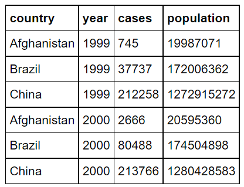

## Definitions:

* The concept of tidy data was developed by Hadley Wickham, a statistician and R programming maestro
* **Definition: Tidy datasets.** More specifically, Wickham defines a tidy data set as one that can be organized into a 2-D table such that
    1. each column represents a variable;
    2. each row represents an observation;
    3. each entry of the table represents a single value, which may come from either categorical (discrete) or continuous spaces.  <br/><br/>
  
    * Visual schematic of this definition:
          <br/><br/>
  
* **Definition: Tibbles.** Here's one more bit of terminology: if a table is tidy, we will call it a tidy table, or tibble, for short.

## Merging data frames: join operations

* For instance, consider the following two tables, A and B:  
      <br/><br/>

* We can combine A, B to form C (join on country and year)  
      <br/><br/>

* In Pandas, you can perform this merge using the .merge() function:  
    ```C = A.merge (B, on=['country', 'year'])```

* Joins. This default behavior of keeping only rows that match both input frames is an example of what relational database systems call an inner-join operation. But there are several other types of joins.

    * Inner-join (A, B) (default): Keep only rows of A and B where the on-keys match in both.
    * Outer-join (A, B): Keep all rows of both frames, but merge rows when the on-keys match. For non-matches, fill in missing values with not-a-number (NaN) values.
    * Left-join (A, B): Keep all rows of A. Only merge rows of B whose on-keys match A.
    * Right-join (A, B): Keep all rows of B. Only merge rows of A whose on-keys match B.

## Apply functions to data frames

* Another useful primitive is apply(), which can apply a function to a data frame or to a series (column of the data frame).
* For instance, suppose we wish to convert the year column in C into an abbrievated two-digit form. The following code will do it:  
    ```
    display(C)
    G = C.copy() # If you do not use copy function the original data frame is modified
    G['year'] = G['year'].apply(lambda x: "'{:02d}".format(x % 100))
    display(G)
    ```
## Basic tidying transformations: Melting and casting
* Given a data set and a target set of variables, there are at least two common issues that require tidying.

    ### Melting
    First, values often appear as columns. the table below is an example. To tidy up, you want to turn columns into rows:  
      <br/><br/>

* Because this operation takes columns into rows, making a "fat" table more tall and skinny, it is sometimes called melting.  

* To melt the table, you need to do the following.

    1. Extract the column values into a new variable. In this case, columns "1999" and "2000" of table4 need to become the values of the variable, "year".
    2. Convert the values associated with the column values into a new variable as well. In this case, the values formerly in columns "1999" and "2000" become the values of the "cases" variable.

* Below is the code block to perform melt:
    ```
    df_wide = pd.DataFrame({'country': ['Áfghanistan', 'Brazil', 'China'],
                    '1999': [745, 37737, 212258],
                    '2000': [26666, 80488, 213766]})

    df_wide.melt(id_vars=["country"],
             var_name="year",
             value_name="cases")
    ```

    ### Casting

* The second most common issue is that an observation might be split across multiple rows. The table below is an example. To tidy up, you want to merge rows:  

      <br/><br/>

* Because this operation is the moral opposite of melting, and "rebuilds" observations from parts, it is sometimes called casting.  

* The signature of a cast is similar to that of melt. However, you only need to know the key, which is column of the input table containing new variable names, and the value, which is the column containing corresponding values.
  
* Below is the code block to perform cast:
    ```
    df_tall = pd.DataFrame({'country': ['Áfghanistan']*4 + ['Brazil']*4, ['China']*4,
                   'year': ['1999', '1999', '2000', '2000', '1999', '1999', '2000', '2000', '1999', '1999', '2000', '2000'],
                   'key': ['cases', 'population', 'cases', 'population', 'cases', 'population', 'cases', 'population'],
                   'value': [745, 19987071, 2666, 20595360, 37737, 172006362, 80488, 174504898, 212258, 1272915272, 213766, 1280428583]}

    df_tall.pivot_table(values='value', index=['country', 'year'], columns='key').reset_index()
    ```