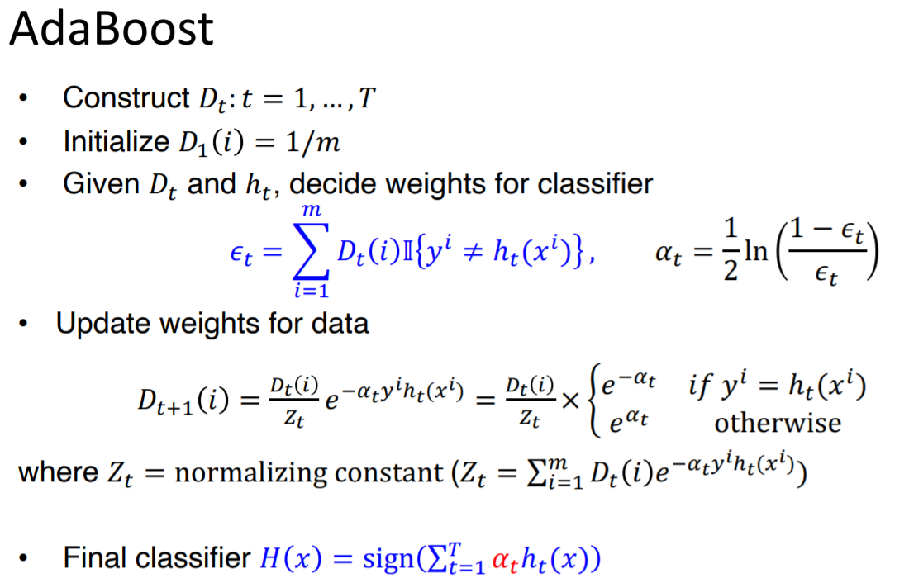

## Adaboost
* Weak learners in AdaBoost are decision trees with a single split or decision stumps
* It works by weighting the observations, putting more weight on difficult to classify instances and less on those already handled well. New weak learners are added sequentially that focus their training on the more difficult patterns.
* Predictions are made by majority vote of the weak learners’ predictions, weighted by their individual accuracy

* Algorithm:

    

* In summary:
    1. We first compute sample weight (initialized as 1/m) for each observation in our dataset.
    2. Construct a stump using best split, minimizing error (for eg, minimizing sum of squared residuals)
    3. Compute error of classification/regression
    4. Compute amount of say a stump has. (Amount of say = 0.5 * log((1 - Total_Error)/ Total_Error))
    5. Compute new sample weight. This places emphasis for the next stump to correctly classify the misclassified observation for current stump
        * new sample weight = sample weight * e ^ (amount of say). (For incorrectly classified samples)
        * new sample weight = sample weight * e ^ (- amount of say) (Fore correctly classified samples)
    6. Normalize the new sample weights to add up to 1
    7. Repeat steps 2 - 7 until convergenece (max number of stumps reached or error crosses minimum threshold)
