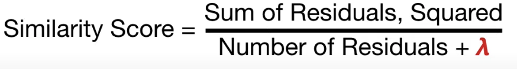
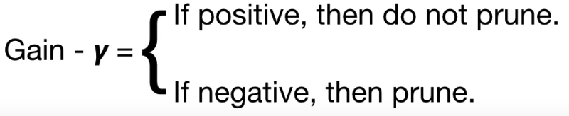
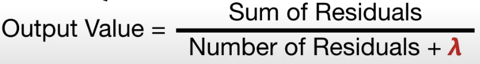
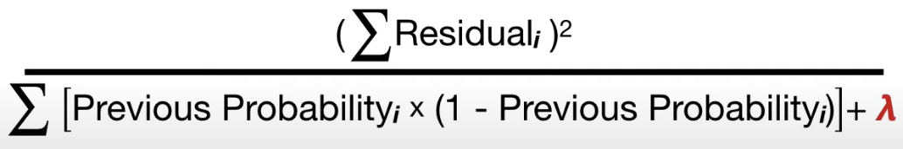
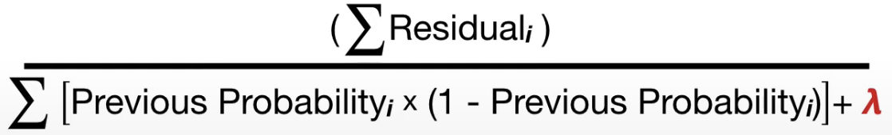

## XGBoost

### What is XGBoost
* Xtreme Gradient Boosting is a high-performance implementation of gradient boosted decision trees

### XGBoost Regression
* The algorithm is as outlined below:  
    1. Similar to gradient boosting algorithms, get an initial prediction  
    for i = 1 to M trees:  
    2. i) Calculate similarity scores for each node in a potential tree:  
              
        where λ (hyperparameter) is the regularization term that will restrict depth of tree. The higher λ is, the more pruning is done, by shrinking the similarity sscores, resulting in smaller output similarity scores from the leaves of the tree. It also results in smaller output values for the leaves.
    2. ii) Use the gain to determine how to split the data:
             
        We use the split that gives us the highest gain
    3. Prune the tree iteratively by calculating differences between gain value in the lowest branch and a user defined Tree Complexity Parameter γ (hyperparameter):
            
        (Note that the tree is also pruned by a measure called cover, which in the case of regression, is the min number of residuals in each leaf node. The default value is 1, and can be set by the min_child_weight hyperparameter)
    Repeat until M trees are built or until a sufficiently small training error is reached
    4. For each tree, during prediction, calculate the output value:
             
    5. Take initial prediction (usually mean of target variable) / default_value=0.5, and add learning_rate * output for each tree in the algorithm, to get the final result. Note that this optimal output value formula is derived from taylor series approximation of order two to the true loss function, and taking the derivative of that with respective to output value and setting it to 0 (sum of gradients)/ (sum of hessians + λ)

### XGBoost Classification
* XGBoost classification is very similar to Regression, with the difference being just the loss function and fitted values (logodds)
* The algorithm for classification is as such:
    1. Get an initial prediction  
    for i = 1 to M trees:  
    2. i) Calculate the similarity scores for each node in a potential tree:
              
             where λ (hyperparameter) is the regularization term that will restrict depth of tree. The higher λ is, the more pruning is done, by shrinking the similarity sscores, resulting in smaller output similarity scores from the leaves of the tree. It also results in smaller output values for the leaves.
    2. ii) Use the gain to determine how to split the data:
             
        We use the split that gives us the highest gain
    3. Prune the tree iteratively by calculating differences between gain value in the lowest branch and a user defined Tree Complexity Parameter γ (hyperparameter):
            
        (Note that the tree is also pruned by a measure called cover, which in the case of classification, is the min sum of previous probabilities * (1 - previous probabilities). The default value is 1, and can be set by the min_child_weight hyperparameter)
     4. For each tree, during prediction, calculate the output value:
             
    5. Take initial prediction (usually mean of target variable) / default_value=0.5, and add learning_rate * output for each tree in the algorithm, to get the final result. Note that this optimal output value formula is derived from taylor series approximation of order two to the true loss function, and taking the derivative of that with respective to output value and setting it to 0 (sum of gradients)/ (sum of hessians + λ)
    6. Convert the logodds predictions to probability

* XGBoost classification is exactly = XGboost Regression in algorithmic form, the only thing that differs is the loss function

* The similarity measure is actually the optimal output value substituted into the formula for -1 * loss function (approximated using the Taylor series!)

## Optimizations:
1. Approximate Greedy Algorithm
    * Checking every single threshold for every single variable is computational expensive
    * Divide the data into quantiles, and check threshold at defined quantiles
    * By default, approximate greedy algorithm uses about 33 quantiles (approximate quantiles)
2. Weighted Quantile Sketch & Parallel Learning
    * Quantile Sketch parallelizes calculation of quantiles by partitioning the data and afterwards combining again the calculations from different nodes
    * Here, the quantiles are weighted, meaning each observation has a corresponding weight, and the sum of the weights is the sum for each quantile
    * The weights are derived from the cover metric, specifically they are the hessians of the loss function
    * For regression, the quantiles are normal quantiles and contain an equal no. of obs
    * For classification, we obtain confidence of prediction, these will then be summed such that the sum of weights are similar for each quantile. The advantage is that we can split observations with low confidence into separate bins, getting smaller quantiles when we need them.  

* The above 2 are only use when the dataset is huge. When the dataset is small, XGBoost uses a normal greedy algorithm

3. Sparsity-Aware Split Finding
    * Split data into 2 subsets, 1 with values and 1 with missing values for a feature.
    * Sort the data with values by the feature.
    * Iteratively find thresholds to split on for the data with values as usual
    * Insert in the missing values in either the left or right split of the tree generated and calculate gain. This will become a candidate tree
    * This will become the method that the algorithm deals with missing values for this feature

4. Cache-Aware Access
    * Puts gradients and hessians in the cache to rapidly calculate the output and similarity values

This is 1 elegant algorithm!!!  
Statistical Optimization + Computational Efficiency  
Mind = Blown 🤯