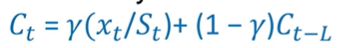
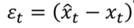
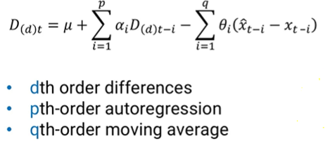

## Exponential Smoothing:

* Exponential smoothing is a rule of thumb technique for smoothing time series data using the exponential window function. Whereas in the simple moving average the past observations are weighted equally, exponential functions are used to assign exponentially decreasing weights over time.

* Formula for Exponential Smoothing:

    

* where T_t is the trend at time period t with initial condition T_1=0, L is the length of a cycle (for weekly cycles, L=7 for eg), C_t is the multiplicative seasonality factor for time t.

* We update the cyclic factor by:

    

* Triple Exponential smoothing (Baseline + Trend + Seasonality) is also known as Holt Winter's Method.

## ARIMA Models:

* Autoregressive integrated moving average models is a class of statistical models for analyzing and forecasting time series data.

* Consists of 2 main components:
    1. Autoregression - Using past values to predict future values (i.e. x_1, x_2, ..., x_{t-1} to predict x_t). For ARIMA, we use p time periods (x_t, x_{t-1}, ..., x{t-(p-1)}) to predict dth order differences

    2. Moving Average - Using previous errors as predictors  
        

* Full formula:  
  
p,d,q can be found using software (using auto arima) or using stationarity tests and inspecting ACF and PACF plots