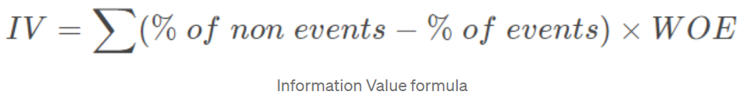
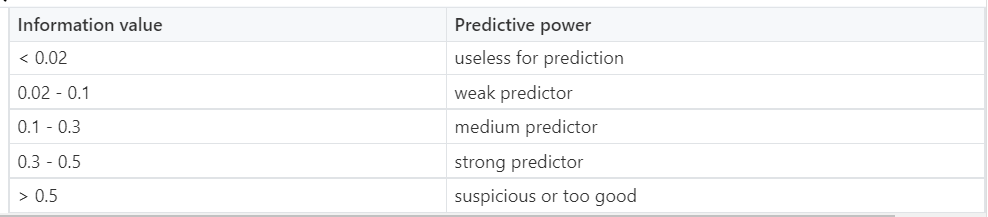
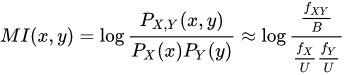

## Techniques to reduce bias:

### Information Value
* Information Value gives a measure of how variable X is good in distinguishing between a binary response (e.g. “good” versus “bad”) in some target variable Y. Low Information Value of a variable X means that it may not classify the target variable on a sufficient level and should be removed as an explanatory variable

      

* General guideline for IV:

      

## Stepwise Feature Elimination
* **Forward Selection:** -  Forward selection is an iterative method in which we start with having no feature in the model. In each iteration, we keep adding the feature which best improves our model till an addition of a new variable does not improve the performance of the model.
* **Backward Selection:** -  In backward elimination, we start with all the features and removes the least significant feature at each iteration which improves the performance of the model. We repeat this until no improvement is observed on removal of features.
* **Recursive Feature elimination:** It is a greedy optimization algorithm which aims to find the best performing feature subset. It repeatedly creates models and keeps aside the best or the worst performing feature at each iteration. It constructs the next model with the left features until all the features are exhausted. It then ranks the features based on the order of their elimination.
* Note that for Logistic Regression or Linear Regression, typically, stepwise selection methods are applied with p-value being used to evaluate if all features are statistically significant

## Techniques to reduce variance:

### Mutual Information
* Mutual information is calculated between two variables and measures the reduction in uncertainty for one variable given a known value of the other variable.

        

* The mutual information between two random variables X and Y can be stated formally as follows:
    I(X ; Y) = H(X) – H(X | Y)
    Where I(X ; Y) is the mutual information for X and Y, H(X) is the entropy for X and H(X | Y) is the conditional entropy for X given Y

* Mutual information is often used as a general form of a correlation coefficient

## Bivariate Correlation
* Finding out all bivariate correlations between continuous variables and eliminate variables based on threshold (for eg, 0.9)

## Chi-square Test
* Select the desired number of features with the best Chi-square scores. Variables have to be categorical, sampled independently and values should have an expected frequency greater than 5

## Variance Inflation Factor
* Checks for collinearity amongst variables. Typically, features with VIF > 5 are filtered out

## Regularization
* Techniques include LASSO, Ridge Regression and ElasticNet. LASSO is able to enforce the β coefficients to become 0. LASSO should be used when variables are sparse. Lasso tends to do well if there are a small number of significant parameters and the others are close to zero (ergo: when only a few predictors actually influence the response). Ridge works well if there are many large parameters of about the same value (ergo: when most predictors impact the response). 