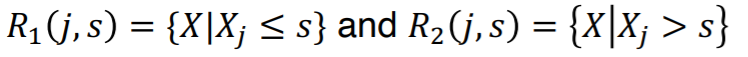
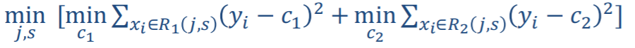
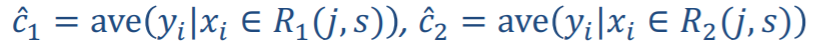
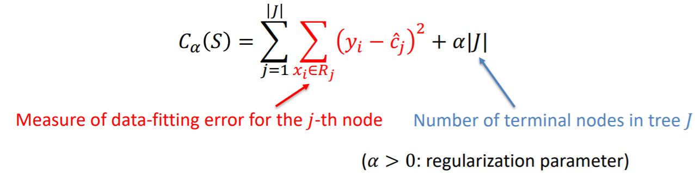
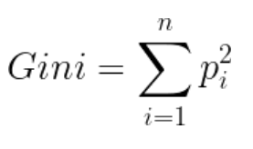
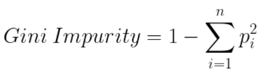
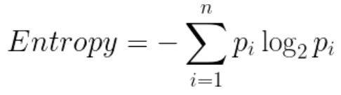
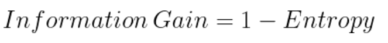
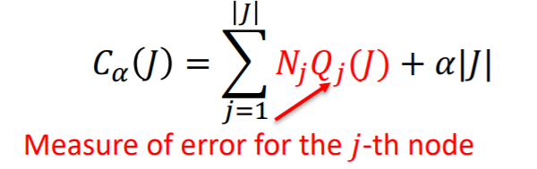

## Overview

* Decision Trees (DTs) are a non-parametric supervised learning method used for classification and regression
* The goal is to predict a target variable by learning simple decision rules inferred from the data features
* It is a simple method and easy to interpret but can be noisy and overfit to data

## Regression Tree

* Choose a variable at each step that best split the region
* For each step, split by variable j, position s, define half spaces as:

      

* Solve the problem for optimal splitting and "regression"

      

* Once (j, s) have decided, optimal prediction is simple:

      

    ### Tree Pruning:
    * Grow a large tree, stop when a minimum node size has reached, then performing pruning by minimizing the cost function 
          

## Classification Tree'

* 2 common criterion for splitting nodes for classification trees are Gini and Entropy

    1. **Gini** - Gini is the probability of correctly labeling a randomly chosen element if it was randomly labeled according to the distribution of labels in the node  
          

    * Gini Impurity:  
          

    * The lower the Gini Impurity, higher is the homogeneity of the node. The aim is to perform splits until the terminal nodes are as homogenous as possible.

    * Gini Impurity is less computationally intensive than Information Gain because it does not contain logarithms

    2. **Information Gain/Entropy** - Entropy is used for calculating the purity of a node. The lower the value of entropy, higher is the purity of the node.  
          

    * Information gain is the reduction in entropy given a certain split.  
          

    * The aim is to select splits with the lowest entropy or highest information gain until nodes are homogenous

    ### Tree Pruning
      
    where measure of error could be gini index, misclassification error or cross-entropy

    * Tutorial on tree pruning on kaggle: https://www.kaggle.com/arunmohan003/pruning-decision-trees-tutorial

## Types of Decision Trees
* CHAID uses chi-square tests to find the most dominant feature whereas ID3 uses information gain, C4.5 uses gain ratio and CART uses GINI index

## Pros and Cons of decision trees  

**Pros:**
* Trees (if grown large enough) can capture complex structures
* They are highly interpretable as they are a set of rules which humans can understand  
* Requires little data preprocessing: no need for one-hot encoding, dummy variables
* Non-parametric model: no assumptions about the shape of data

**Cons:**
* They can give noisy outcomes depending on the type of split and depth of tree and number of nodes
* A small change in the data tends to cause a big difference in the tree structure, which causes instability
  
## Combining weak learners  
* Weak decision tree learners can be combined in 2 main ways, bagging and boosting

### Bagging:
* Run weak learners on bootstrap replicates of the training set
* Bootstrapping means to retake samples with replacement from the original samples of the dataset and train weak learners on each retaken sample. Averaging these weak learners can reduce the variance. This is what Random Forest is about

## Boosting:
* Run weak learner on weighted example sets. Most boosting algorithms consist of iteratively learning weak classifiers with respect to a distribution and adding them to a final strong classifier. When they are added, they are weighted in a way that is related to the weak learners' accuracy. After a weak learner is added, the data weights are readjusted, known as "re-weighting". Misclassified input data gain a higher weight and examples that are classified correctly lose weight.

## Other resources:
* Tuning hyperparameters of decision trees - https://towardsdatascience.com/how-to-tune-a-decision-tree-f03721801680