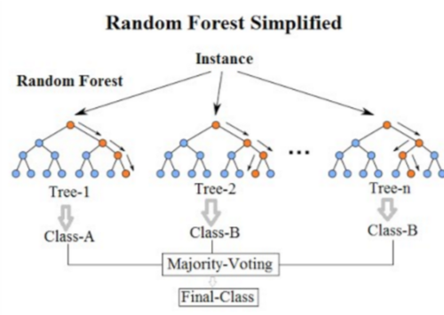

## What is Random Forest?
* Random forest is a classification algorithm consisting of many decisions trees. It uses bagging and feature randomness when building each individual tree and ensembles them when doing predictions.

## Algorithm:
* For b = 1, .., B
* Draw bootstrap sample Z_b of size N from training data
* Grow a random forest tree T_b from the bootstrapped data by
    * Select v variables at random from p variables
    * Pick the best variable/split among the v
    * For classification, v ~= floor(sqrt(p)), for regression, the default value v ~= floor(p/3)
    * Split the node into two children nodes
* Output ensemble of trees T_b, b = 1, … , B
* To make prediction for a new point x  
    
      

## OOB error
* For each observation z_i = (x_i, y_i), construct the random forest predictor by averaging only those trees corresponding to bootstrap samples in which z_i did not appear.
* OOB error estimate is almost identical to that obtained by K-fold cross validation

## Feature Importance
* There are several ways to compute feature importances, with a random forest model.
1. Gini importance (or mean decrease impurity), which is computed from the Random Forest structure. Measure how each feature decrease the impurity of the split (the feature with highest decrease is selected for internal node). For each feature we can collect how on average it decreases the impurity. The average over all trees in the forest is the measure of the feature importance. The advantage of this is speed of computation while disadvantage is that it has a tendency to prefer numerical features and categorical features with high cardinality
2. Mean Decrease Accuracy - Method of computing the feature importance on permuted out-of-bag (OOB) samples based on mean decrease in the accuracy
3. Permutation Based Feature Importance -  This method will randomly shuffle each feature and compute the change in the model’s performance. The features which impact the performance the most are the most important one. Requires high computing power and can have problem with highly-correlated features, it can report them as unimportant.