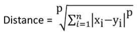
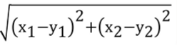
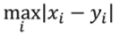

## What is Clustering
* Clustering is the task of grouping a set of objects in such a way that objects in the same group are more similar to each other than to those in other groups. It is done without any label to any of the object.

## Examples of Uses
* Targeted marketing/segmentation

## Distance Norms:
* One way of measuring similarity is by using distance norms. A generalization of distance norm is the p-norm distance (Minkowski distance):
 

* p-norm is a generalization of 2-norm, which is the Euclidean distance (most commonly used):
 

* For infinity-norm distance, it can be simplified to:
 

## Pseudo-code:
0. Pick k cluster centers within range of data
1. Assign each data point to the nearest cluster
2. Recalculate cluster centers (centroids)
3. Repeat 0., 1., 2. until points in each cluster is sufficiently close to one another.

## Summary
* In short K-means algorithm:
    * is a heuristic (is fast and good but may not converge to best solution, although it is guaranteed to reach a local optimum)

    * Works on expectation-maximization (EM)
        * Expectation step: Find cluster centers by averageing over all points in cluster
        * Maximization step: Assign points to respective cluster (that is closest to each point)