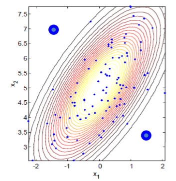
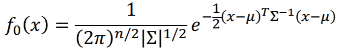
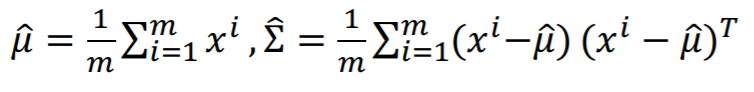
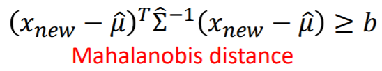
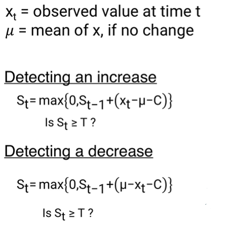

In general, we can use 2 main categories of methods to detect anomalies, statistical methods and geometric methods

## Statistical Methods

### 1. Density-based Methods
* Declare data points in low density region as anomalies
* For eg, fit density to normal data f_hat(x) then set a threshold epsilon. If data points are in region with density small than epsilon, then declare them as anomalies.

    

### 2. Covariance-based Methods
* First we estimate a multivariate normal distribution:
       

* Find parameter estimation from data:
       

* For a new data, having f_hat(x_new) <= epsilon is equivalent to:  
      
    for some threshold b

* Mahalanobis distance can be affected by outliers. We can use Minimum Covariance Determinant estimator (MCD) to find a subset of observations whose empirical covariance has the smallest determinant |Σ_hat|

## Geometric methods
* Rather than first fit density and then find threshold, directly find the boundary
* An example of this is the SVM based one-class classification

## CUSUM for Change Detection:
* Detects abnormal increase/decrease or both, trends in a time series value
* Given a value xt, and it's expected value if there's no change, along with C (a parameter we use to adjust for random fluctuations of x, as x may fluctuate above the threshold randomly and not due to an anomaly), and T, a threshold, we measure at a particular time step, whether an anomalous change has occured:

    

Comparison of algorithms for anomaly detection (sciki-learn): https://scikitlearn.org/stable/auto_examples/miscellaneous/plot_anomaly_comparison.html#sphx-glrauto-examples-miscellaneous-plot-anomalycomparison-py