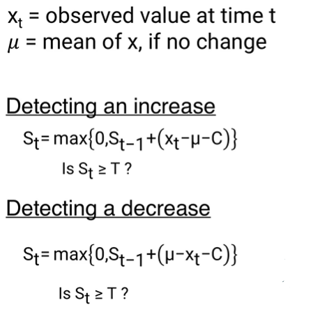

## CUSUM for Change Detection:
* Detects abnormal increase/decrease or both, trends in a time series value
* Given a value xt, and it's expected value if there's no change, along with C (a parameter we use to adjust for random fluctuations of x, as x may fluctuate above the threshold randomly and not due to an anomaly), and T, a threshold, we measure at a particular time step, whether an anomalous change has occured:

    