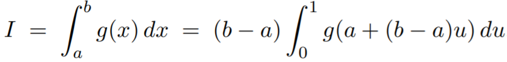
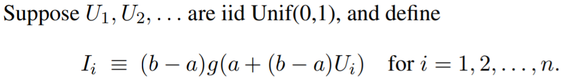
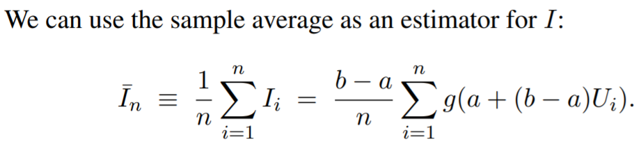
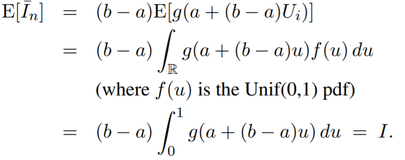
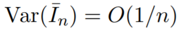
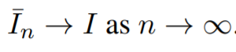
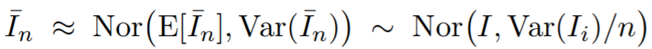
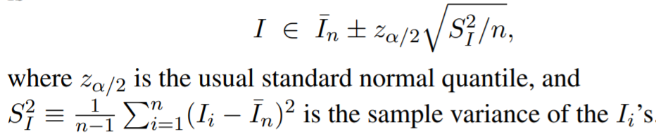
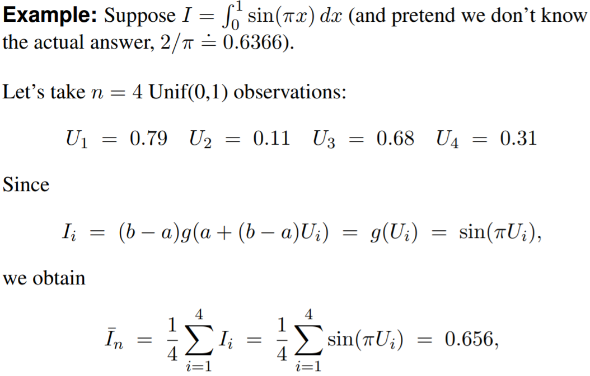
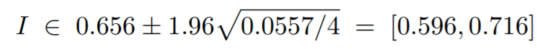

## Monte Carlo Integration

* Monte Carlo integration is a technique for numerical integration using random numbers
* It is used to estimate the possible outcomes of an uncertain event

### Equation:
* Here's our equation:  
          
    This is simply derived using integration by substitution   
         
          
    
    **Proof for Unbiasness:**  
          

    It can also be shown that:  
          

    The law of large numbers implies:  
          

### Approximate Confidence Interval:
* By Central Limit Theorem:  
      
    Thus, a reasonable 100(1 − α)% confidence interval for I is:
      

### Example of MC Integration:  
* An example of MC Integration
      

    Confidence Interval:
       

    We can definitely do better by increasing n! (n=4 is too small, causing a fat confidence interval)