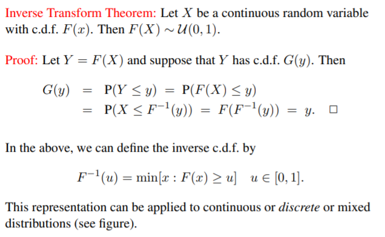
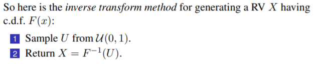
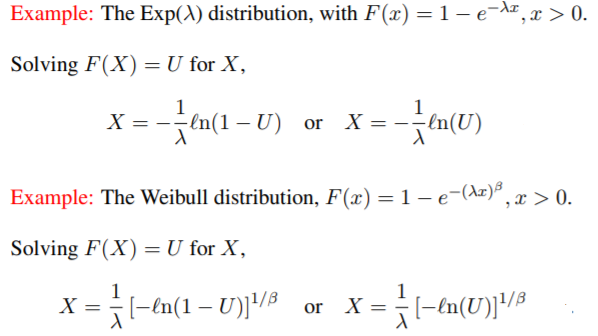
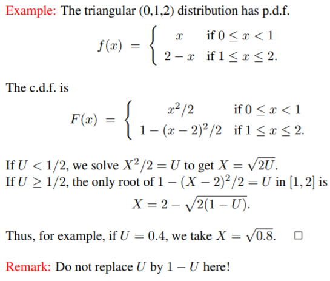
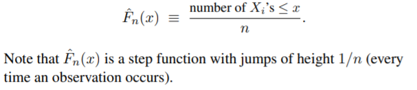
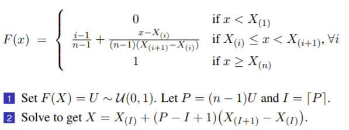
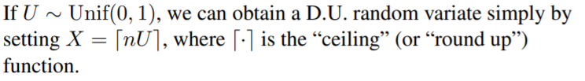
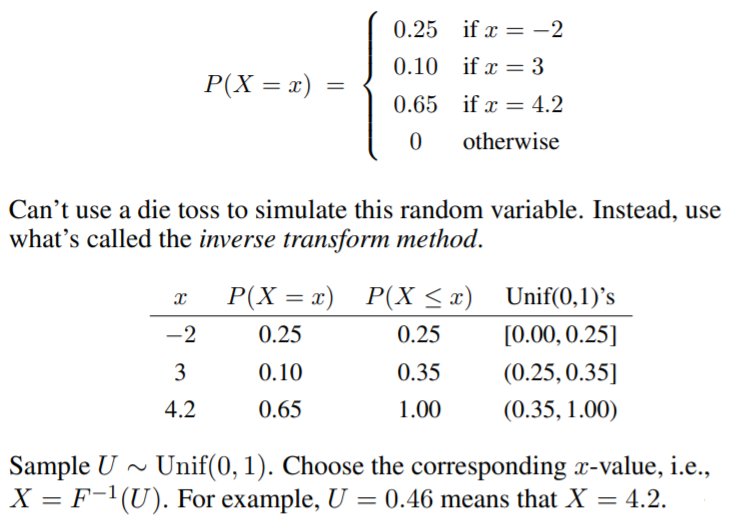

## Inverse Transform Method:
* Inverse Transform Method definition and derivation:  
     
     

## Generating continuous random variables:
* Examples of deriving U from F(X):  
      
      

## Continuous Empirical Distributions:
* If we can’t find a good theoretical distribution to model a certain RV, we may want to use the empirical c.d.f. of the data, X1, X2, . . . , Xn
      
* Even though X is continuous, the Glivenko-Cantelli Lemma says that ^Fn(x) → F(x) for all x as n → ∞. So ^Fn(x) is a good approximation to the true c.d.f., F(x)
* Given that we only have a finite number n of data points, we can turn the empirical c.d.f. into a continuous RV by using linear interpolation between the X(i)’s.
      

## Generating discrete random variables:
* Generating Discrete uniform RVs:  
      
    For eg, if we want to simulate a dice, n will be equals to 6.

* Generating Discrete non-uniform RVs:  
    We have to use the inverse transform method
     
