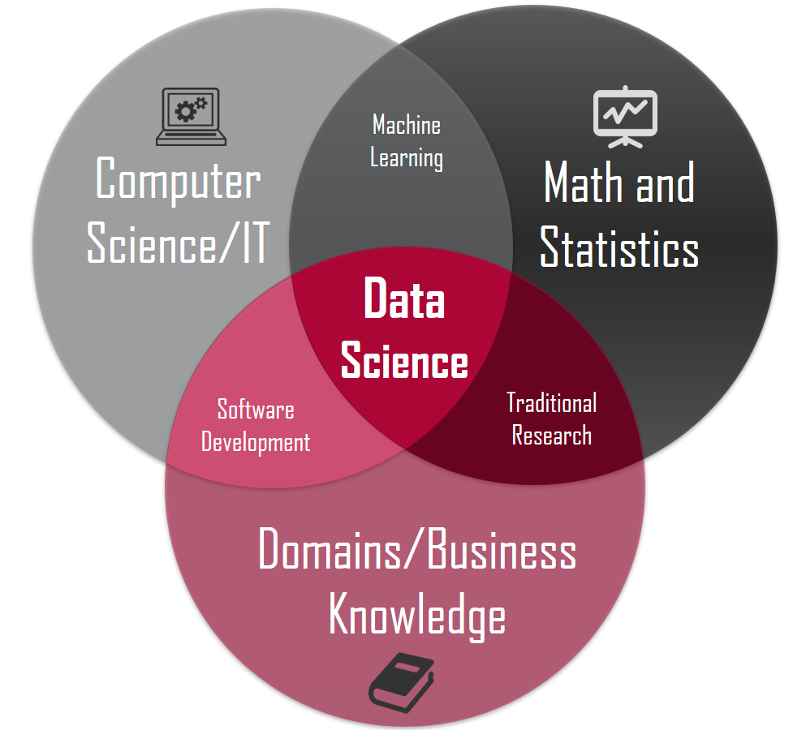

# Data-Science-Portfolio
---
:rocket: This repository contains notes I have taken and projects I have embarked on, relating to Data Science. 
  
Projects are presented as Python Jupyter Notebooks (.ipynb) and Python Scripts (.py) while notes are in markdown files (.md)

I got the inspiration for this layout from [this github repo](https://github.com/sajal2692/data-science-portfolio)

Any feedback is greatly welcomed. Please feel free to drop me an email at alanchn31@gmail.com

## Overview
---
Within the realm of data science, lies 3 main domains:

(image from: https://www.datasciencesociety.net/data-science-career-path-after-college/)

Hence, this repo will be structured around 2 main areas:
1. Operations Research (Stats & Probability applied to business)
2. Machine Learning